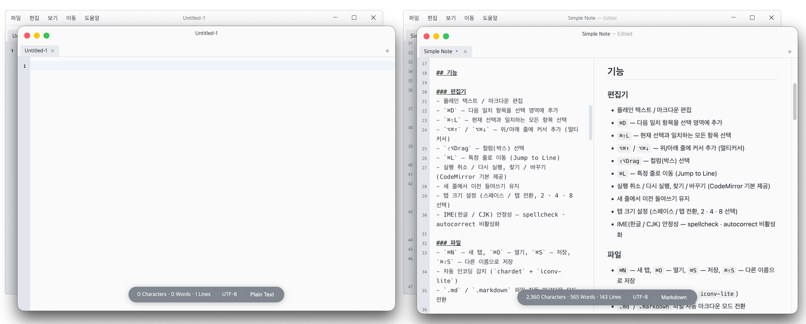

# Simple Note

<p align="center">
    
</p>

<p align="center">
  집중해서 글을 쓰기 위한 깔끔하고 직관적인 텍스트 에디터
  <br/>
  <a href="https://github.com/brunophilipe/Noto">brunophilipe/Noto</a> 의 철학을 바탕으로 개발되었습니다.
  <br/>
  <br/>
  <a href="https://www.apple.com/macos/"></a>
  <a href="https://www.microsoft.com/windows/"></a>
  <a href="https://nodejs.org/"></a>
  <a href="https://www.npmjs.com/"></a>
  <a href="LICENSE"></a>
</p>




---

## 기능

### 텍스트 및 마크다운 편집
- **강력한 편집 기능:** 다중 커서, 일괄 선택, 블록 선택 등 효율적인 텍스트 편집 기능을 제공합니다.
- **편리한 탐색:** 찾기/바꾸기 및 특정 줄로 바로 이동하는 기능을 지원합니다.
- **맞춤형 설정:** 들여쓰기 유지, 탭/스페이스 전환 및 크기 설정을 자유롭게 할 수 있습니다.
- **다국어 지원:** 한글 등 CJK 입력 시 발생할 수 있는 오류를 방지하여 안정적인 타이핑 경험을 제공합니다.

### 파일 관리
- **다중 탭 지원:** 여러 파일을 동시에 열어놓고 탭으로 드래그 앤 드롭하여 순서를 변경하거나 편리하게 작업할 수 있습니다.
- **자동 감지 기능:** 문서를 열 때 자동으로 텍스트 인코딩을 감지하여 글자 깨짐을 방지하고, 마크다운 파일의 경우 자동으로 편집 모드를 전환합니다.

### 마크다운 최적화
- **실시간 문법 강조:** 제목, 굵게/기울임, 코드, 링크 등 마크다운 요소들이 시각적으로 구분되어 작성에 집중할 수 있습니다.
- **분할 화면 미리보기:** 작성 중인 마크다운 문서를 실시간으로 확인하며 편집할 수 있으며, 구분선을 드래그해 미리보기 창의 비율을 자유롭게 조절할 수 있습니다.
- **안전하고 정확한 렌더링:** 코드 블록의 구문 강조를 완벽하게 지원하며, 보안 위협(XSS)으로부터 안전하게 문서를 표시합니다.

### 사용자 친화적 UI
- **다크/라이트 테마:** 작업 환경과 취향에 맞게 에디터 테마를 손쉽게 변경할 수 있습니다.
- **문서 정보 표시:** 현재 문서의 글자 수, 단어 수, 줄 수 및 언어 모드 등 유용한 정보를 하단 바에서 한눈에 확인 가능합니다.
- **유연한 화면 설정:** 화면 확대/축소, 폰트 크기 조절 등을 사용자 편의에 맞게 조정할 수 있습니다.
- **OS 네이티브 경험:** 각 운영체제(macOS, Windows) 고유의 깔끔한 디자인을 적용하여 이질감 없는 매끄러운 사용성을 제공합니다.

---

## 요구사항

| 항목 | 버전 |
|---|---|
| 운영체제 | macOS 13 Ventura 이상 또는 Windows 10 이상 |
| Node.js | v20.x |
| npm | v10.x |

---

## 개발 환경 실행

```bash
# 의존성 설치
npm install

# 개발 서버 + Electron 실행
npm run dev
```

## 빌드

```bash
# 프로덕션 빌드
npm run build

# OS용 패키지 생성
npm run package
```

빌드 결과물은 `dist/` 디렉터리에 생성됩니다.

### ⚠️ Windows 빌드(패키징) 시 주의사항
Windows 환경에서 `npm run package` 실행 시 `winCodeSign` 관련 심볼릭 링크 생성 에러(`ERROR: Cannot create symbolic link`)가 발생하며 빌드가 실패할 수 있습니다. 이는 Windows의 보안 정책 때문이며, 다음 중 하나의 방법으로 해결할 수 있습니다.

1. **개발자 모드 활성화 (권장)**: Windows 설정 > 시스템(또는 업데이트 및 보안) > 개발자용 > **'개발자 모드' 켬**으로 변경
2. **관리자 권한으로 실행**: 사용 중인 터미널(VS Code, PowerShell, CMD)을 **'관리자 권한'으로 실행**한 후 패키징 명령어 입력

---

## 기술 스택

| 구분 | 패키지 |
|---|---|
| 런타임 | Electron 41 |
| UI | React 18 + TypeScript |
| 에디터 | CodeMirror 6 |
| 상태 관리 | Zustand 5 |
| 마크다운 | marked + marked-highlight + highlight.js + DOMPurify |
| 설정 저장 | electron-store 8 |
| 인코딩 | chardet + iconv-lite |
| 빌드 | vite 8 + electron-vite 5 + electron-builder 26 |

---

## 디렉터리 구조

```
src/
├── main/           # Electron 메인 프로세스
│   ├── index.ts    # BrowserWindow 생성
│   ├── ipc.ts      # IPC 핸들러 (파일, 설정, 다이얼로그)
│   ├── menu.ts     # OS 네이티브 메뉴
│   ├── fileManager.ts  # 파일 읽기/쓰기 + 인코딩
│   ├── store.ts    # 설정 스키마
│   └── logger.ts   # 로거
├── preload/
│   └── index.ts    # API 노출
├── types/
│   ├── settings.ts # 설정 타입
│   └── tab.ts      # 탭 타입
└── renderer/src/
    ├── App.tsx
    ├── components/
    │   ├── TitleBar/
    │   ├── TabBar/
    │   ├── Editor/             # 에디터 코어 + 확장
    │   │   ├── extensions.ts
    │   │   └── markdownPreview/
    │   └── InfoBar/
    ├── store/
    │   ├── tabStore.ts         # 탭 상태 관리
    │   └── settingsStore.ts
    └── hooks/
        ├── useFile.ts
        └── useMenuEvents.ts
```

---

## 라이선스

MIT
