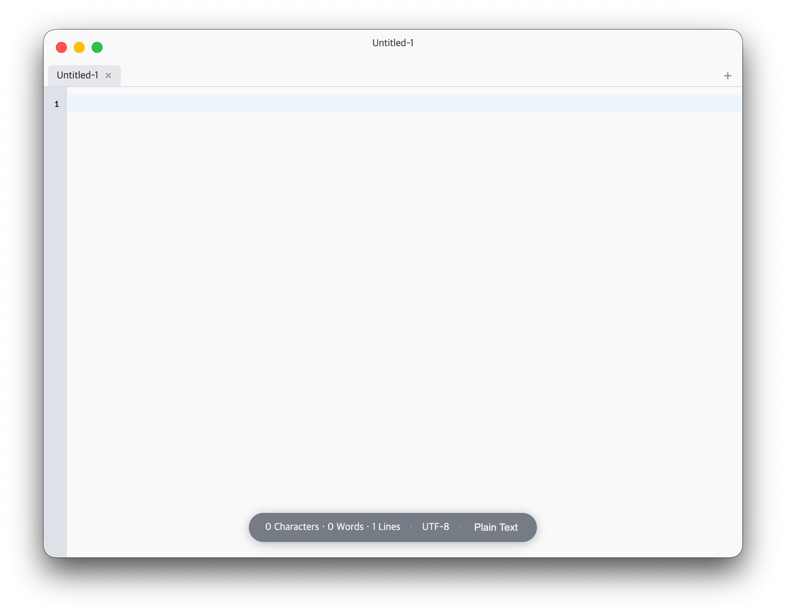
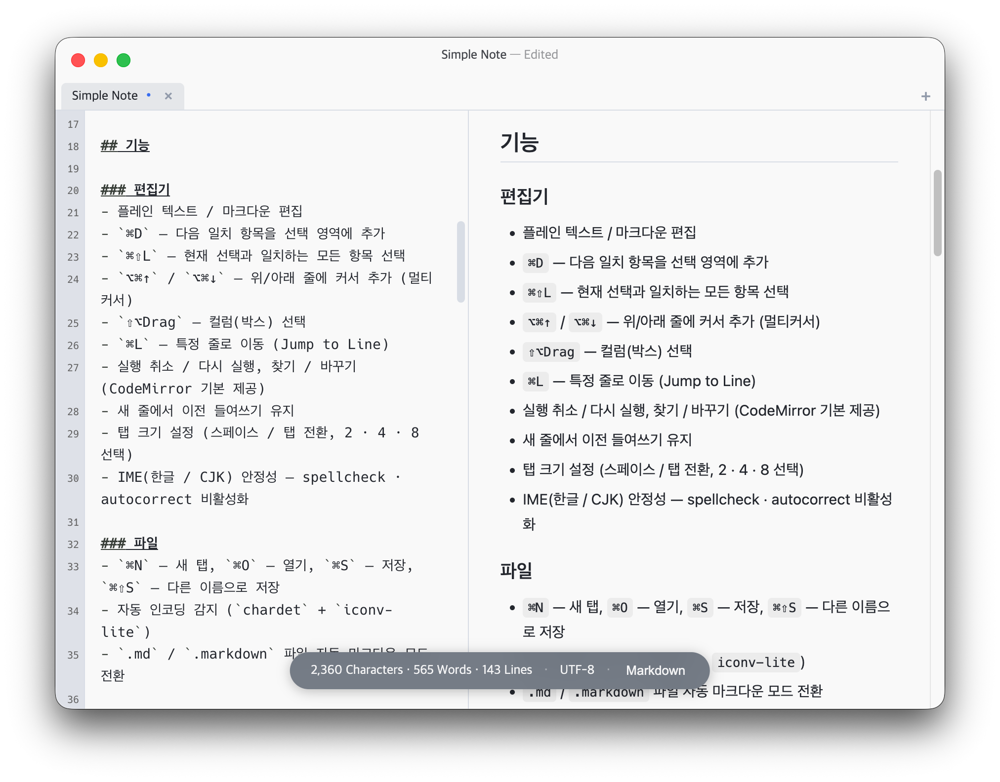

# Simple Note

집중해서 글을 쓰기 위한 macOS 전용 플레인 텍스트 에디터.

[brunophilipe/Noto](https://github.com/brunophilipe/Noto)의 철학을 Electron으로 재구현했습니다.

[](https://www.apple.com/macos/)
[](https://nodejs.org/)
[](https://www.npmjs.com/)
[](LICENSE)

---




---

## 기능

### 편집기
- 플레인 텍스트 / 마크다운 편집
- `⌘D` — 다음 일치 항목을 선택 영역에 추가
- `⌘⇧L` — 현재 선택과 일치하는 모든 항목 선택
- `⌥⌘↑` / `⌥⌘↓` — 위/아래 줄에 커서 추가 (멀티커서)
- `⇧⌥Drag` — 컬럼(박스) 선택
- `⌘L` — 특정 줄로 이동 (Jump to Line)
- 실행 취소 / 다시 실행, 찾기 / 바꾸기 (CodeMirror 기본 제공)
- 새 줄에서 이전 들여쓰기 유지
- 탭 크기 설정 (스페이스 / 탭 전환, 2 · 4 · 8 선택)
- IME(한글 / CJK) 안정성 — spellcheck · autocorrect 비활성화

### 파일
- `⌘N` — 새 탭, `⌘O` — 열기, `⌘S` — 저장, `⌘⇧S` — 다른 이름으로 저장
- 자동 인코딩 감지 (`chardet` + `iconv-lite`)
- `.md` / `.markdown` 파일 자동 마크다운 모드 전환

### 마크다운
- 문법 강조 (헤딩, 굵게/기울임, 코드, 링크, 인용구 등)
- `⌘⌥P` — 미리보기 / 편집 분할 화면 토글
- 분할 화면 구분선 드래그로 비율 조절 (20 % ~ 80 %)
- `marked` + `marked-highlight` + `highlight.js` 기반 렌더링 (코드 블록 구문 강조 포함)
- `DOMPurify`로 XSS 방지

### UI
- 다크 / 라이트 테마 (`보기 > 테마`)
- 폰트 크기 조절 — `⌘+` / `⌘-` / `⌘0`
- HUD 정보 바 (글자 수 · 단어 수 · 줄 수 · 인코딩 · 언어 모드, none / hud / status 전환)
- 언어 모드 인포바 클릭 또는 `보기 > 언어` 메뉴로 전환
- 줄 번호 표시 / 숨기기 (`⌘⇧L`)
- 탭 기반 멀티 파일 편집, 드래그로 탭 순서 변경
- `titleBarStyle: hiddenInset` — macOS 네이티브 트래픽 라이트 유지
- `⌘,` — 환경설정 (폰트, 탭, 인포바 등)

---

## 요구사항

| 항목 | 버전 |
|---|---|
| macOS | 13 Ventura 이상 |
| Node.js | v20.x |
| npm | v10.x |

---

## 개발 환경 실행

```bash
# 의존성 설치
npm install

# 개발 서버 + Electron 실행
npm run dev
```

## 빌드

```bash
# 프로덕션 빌드
npm run build

# .dmg 패키지 생성
npm run package
```

빌드 결과물은 `dist/` 디렉터리에 생성됩니다.

---

## 기술 스택

| 구분 | 패키지 |
|---|---|
| 런타임 | Electron 41 |
| UI | React 18 + TypeScript |
| 에디터 | CodeMirror 6 |
| 상태 관리 | Zustand 5 |
| 마크다운 | marked + marked-highlight + highlight.js + DOMPurify |
| 설정 저장 | electron-store 8 |
| 인코딩 | chardet + iconv-lite |
| 빌드 | electron-vite 2 + electron-builder 26 |

---

## 디렉터리 구조

```
src/
├── main/           # Electron 메인 프로세스
│   ├── index.ts    # BrowserWindow 생성
│   ├── ipc.ts      # IPC 핸들러 (파일, 설정, 다이얼로그)
│   ├── menu.ts     # 네이티브 macOS 메뉴
│   ├── fileManager.ts  # 파일 읽기/쓰기 + 인코딩
│   ├── store.ts    # electron-store 설정 스키마
│   └── logger.ts   # 로거
├── preload/
│   └── index.ts    # contextBridge API 노출
├── types/
│   ├── settings.ts # 설정 타입
│   └── tab.ts      # 탭 타입
└── renderer/src/
    ├── App.tsx
    ├── components/
    │   ├── TitleBar/
    │   ├── TabBar/
    │   ├── Editor/             # CodeMirror 6 래퍼 + 확장
    │   │   ├── extensions.ts   # 키맵, 테마, 멀티커서 등
    │   │   └── markdownPreview/
    │   └── InfoBar/
    ├── store/
    │   ├── tabStore.ts         # 탭 상태 관리
    │   └── settingsStore.ts
    └── hooks/
        ├── useFile.ts
        └── useMenuEvents.ts
```

---

## 라이선스

MIT
